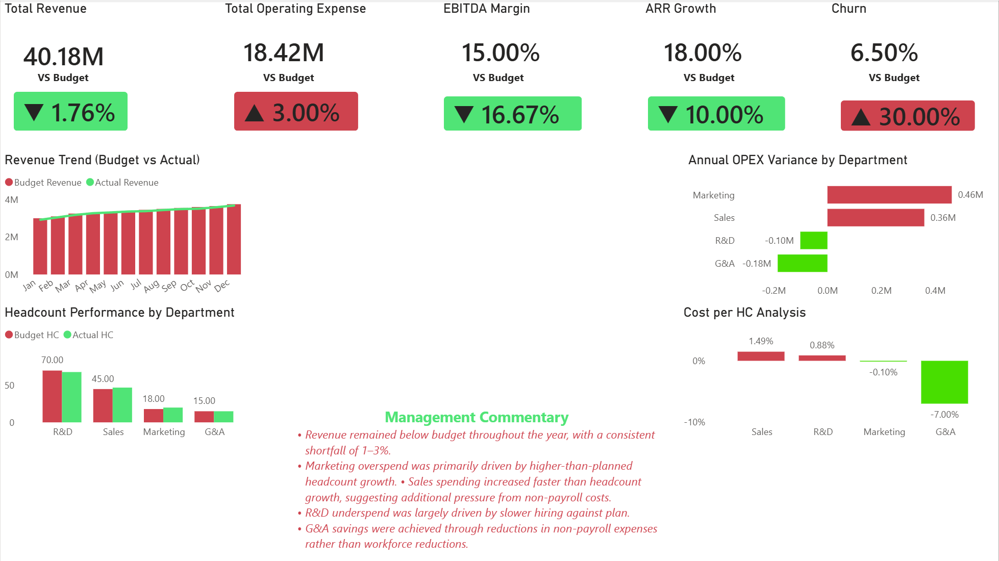

# FP&A Budget vs Actual Dashboard

## Project Overview

This project presents an FP&A Budget vs Actual Dashboard built with Excel and Power BI for a simulated SaaS company.

The dashboard analyzes financial performance against budget, identifies departmental spending variances, and explains operating expense drivers using headcount and cost-per-head analysis.

## Data Source

This project uses a simulated dataset created for portfolio purposes.

The dataset was designed to resemble the monthly reporting package of a mid-sized SaaS company and includes:

- Monthly Budget and Actual Revenue
- Department-level Operating Expenses (Sales, Marketing, R&D, and G&A)
- Headcount Planning Data
- Cost per Employee Metrics
- SaaS Operating KPIs including:
  - ARR Growth
  - EBITDA Margin
  - Gross Margin
  - Churn Rate

The financial assumptions and business scenarios were intentionally designed to reflect common FP&A use cases such as:

- Budget vs Actual Analysis
- Variance Analysis
- Headcount Planning
- Driver-Based Expense Analysis
- Executive KPI Reporting

## Business Objective

The objective of this project was to:

- Compare budgeted and actual financial performance
- Identify favourable and unfavourable variances
- Analyze OPEX performance by department
- Evaluate headcount against plan
- Measure cost per employee
- Present key SaaS performance metrics
- Provide management-level commentary and insights

## Tools Used

- Microsoft Excel
- Power BI
- DAX
- Conditional Formatting
- Data Visualization

## FP&A Dashboard Portfolio

## Conclusion

This project demonstrates a practical FP&A workflow for analyzing financial performance against budget and identifying key operational drivers.

Using Excel and Power BI, the analysis moved beyond simple variance reporting to include headcount planning, cost-per-employee analysis, and SaaS operating metrics.

The dashboard highlighted several key findings:

- Revenue finished 1.76% below plan, indicating a consistent shortfall throughout the year.
- Operating expenses exceeded budget by 3.0%, primarily driven by Sales and Marketing overspend.
- Marketing overspend was largely attributable to higher-than-planned hiring activity.
- R&D underspend reflected slower hiring against plan.
- G&A achieved savings through lower non-payroll spending rather than workforce reductions.
- Higher customer churn contributed to weaker-than-expected ARR growth and EBITDA performance.

This project reflects the type of monthly business review and management reporting process commonly performed by FP&A teams in SaaS organizations.
